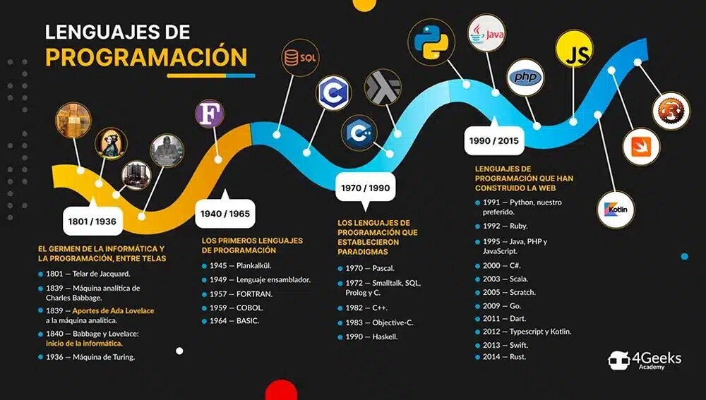
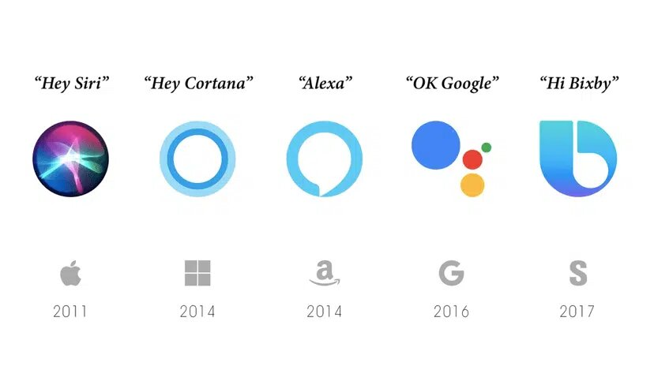
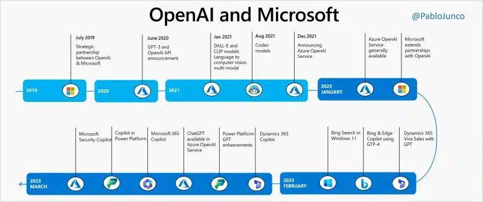

<h1 align="center">TRABAJO</h1>

## AUTOR: JAMES ORDOÑEZ

<h1 align="center">___PROGRAMACION CON IA___ </h1>

## Contenidos

1. [QUE ES PROGRAMACION CON IA](#que-es-programacion-con-ia)
2. [EJEMPLOS DE PROGRAMACION CON IA](#ejemplos-de-programacion-con-ia)
   - [HISTORIA DE LA IA](#historia-de-la-ia)
   - [IMAGENES](#imagenes)
   - [VIDEO DE LA IA](#video-de-la-ia)
3. [ENLACES DE INTERES](#enlaces-de-interes)
4. [REFERENCIAS](#referencias)

## ¿QUE ES PROGRAMACION CON IA?

la programación con inteligencia artificial (IA) es como enseñarle a una computadora a hacer cosas inteligentes, como tomar decisiones, reconocer patrones o entender el lenguaje humano. Es como si estuvieras entrenando a un asistente digital para que haga tareas por ti.

Imagina que estás enseñando a un robot a reconocer gatos en fotos. Primero, le mostraría muchas imágenes de gatos y le diría: "¡Esto es un gato!". Luego, le enseñaría a reconocer las características de los gatos, como las orejas puntiagudas o el pelaje rayado. Después, le mostraría más imágenes y le preguntaría: "¿Hay un gato aquí?".

La programación de IA implica escribir instrucciones para que la computadora pueda aprender de esos ejemplos y tomar decisiones similares por sí misma en situaciones nuevas. Se trata de enseñar a las máquinas a pensar y actuar de manera inteligente, ¡casi como si estuvieran aprendiendo como lo haría un ser humano!

## EJEMPLOS DE PROGRAMACION CON IA

1.**_Reconocimiento facial_** : Programas que pueden identificar caras en fotos o videos, como los que usamos en redes sociales para etiquetar amigos.

2.**_Asistentes virtuales_** : Como Siri, Alexa o Google Assistant, que pueden responder preguntas, realizar tareas y controlar dispositivos a través de comandos de voz.

3.**_Recomendaciones personalizadas_** : Plataformas de streaming como Netflix o Spotify utilizan IA para recomendar películas, música o productos basados ​​en tus preferencias y comportamientos pasados.

4.**_Traducción automática_** : Herramientas como Google Translate utilizan algoritmos de IA para traducir texto de un idioma a otro de manera rápida y precisa.

5.**_Diagnóstico médico_** : Sistemas de IA que ayudan a los médicos a analizar imágenes médicas, como radiografías o resonancias magnéticas, para detectar enfermedades o anomalías.

6.**_Conducción autónoma_** : Tecnologías en vehículos que utilizan IA para detectar señales de tráfico, peatones y otros vehículos, permitiendo la conducción sin intervención humana.

7.**_Análisis de sentimientos_** : Herramientas que pueden analizar el tono emocional en texto o voz, útiles para empresas que desean comprender la opinión de los clientes en redes sociales o encuestas.

8.**_Juegos inteligentes_** : Programas de IA que pueden jugar juegos complejos como ajedrez, Go o videojuegos, utilizando estrategias avanzadas para competir contra humanos o mejorar su propio rendimiento.

9:**_Detección de fraudes_** : Sistemas que utilizan IA para analizar patrones de comportamiento y transacciones financieras y detectar actividades fraudulentas en tiempo real.

10.**_Generación de contenido_** : Modelos de IA que pueden escribir noticias, crear música, generar arte o incluso escribir código, basándose en patrones aprendidos de conjuntos de datos existentes.

## HISTORIA DE LA IA

La inteligencia artificial surge definitivamente a partir de algunos trabajos publicados en la década de 1940 que no tuvieron gran repercusión, pero a partir del influyente trabajo en 1950 de Alan Turing, matemático británico,con lo cual se abre una nueva disciplina de las ciencias de la información.1​

Si bien las ideas esenciales se remontan a la lógica y algoritmos de los griegos, y a las matemáticas de los árabes, el concepto de obtener razonamiento artificial aparece en el siglo xiv. A finales del siglo xix se obtienen lógicas formales suficientemente poderosas y, a mediados del siglo xx, se obtienen máquinas capaces de hacer uso de tales lógicas y algoritmos de solución.

## IMAGENES

| _El desarrollo de la inteligencia artificial_ | _El resurgir de la inteligencia artificial_ | _El presente de la IA_ |
| :-----------------------------------------------------------------------------------------------------------------: | :----------------------------------------------------------------------------------------------------------: | :----------------------------------------------------------------------------------------------: |

## VIDEO DE LA IA

  

## ENLACES DE INTERES

- [ORIGEN ](https://www.youtube.com/watch?v=kwjiqBvXVeA&ab_channel=ConmiMente)
- [LA IA Y COMO FUNCIONA](https://www.youtube.com/watch?v=_tA5cinv0U8&ab_channel=Derivando)
- [IA + CODE GUIA PARA PROGRAMADORES](https://developero.io/ai-for-developers)

  ## REFERENCIAS

  - [APLICACION GEMINI IA ](https://deepmind.google/technologies/gemini/#introduction)
